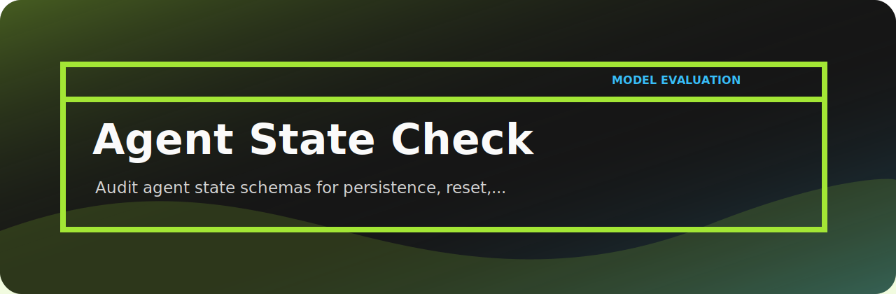

# Agent State Check

Audit agent state schemas for persistence, reset, and user isolation risks.

## First impression



When this tool reports something, I want the finding to be boringly explicit: what matched, how severe it is, and what a reviewer should clean up.

## Tripwires

- `persistent-state` (high): persistent state detected. Fix: review retention and deletion.
- `missing-reset` (medium): reset behavior missing. Fix: add state reset path.
- `missing-isolation` (low): user isolation unclear. Fix: scope state by user or tenant.

## Runbook

```bash
git clone https://github.com/mertefekurt/agent-state-check.git
cd agent-state-check
python -m venv .venv
source .venv/bin/activate
python -m pip install -e ".[dev]"
```

Then:

```bash
agent-state-check examples/sample.txt
agent-state-check examples/sample.txt --json
```

## Development note

The policy lives in `rules.py`; parsing and rendering stay separate so the rule list is easy to audit.
