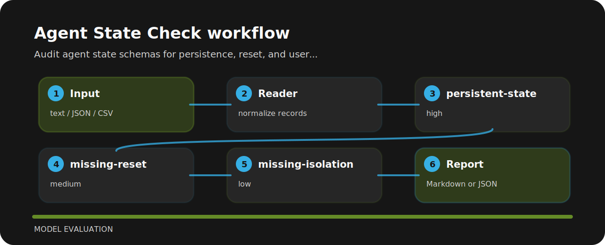

# Agent State Check

Audit agent state schemas for persistence, reset, and user isolation risks.


## Finding map



## Signals

- `persistent-state` - persistent state detected (high); review retention and deletion.
- `missing-reset` - reset behavior missing (medium); add state reset path.
- `missing-isolation` - user isolation unclear (low); scope state by user or tenant.

## Repo landmarks

```text
.github/        CI workflow
examples/       sample inputs
src/            package source
tests/          test coverage
```

## Command path

```bash
git clone https://github.com/mertefekurt/agent-state-check.git
cd agent-state-check
python -m pip install -e ".[dev]"
agent-state-check examples/sample.txt
```
